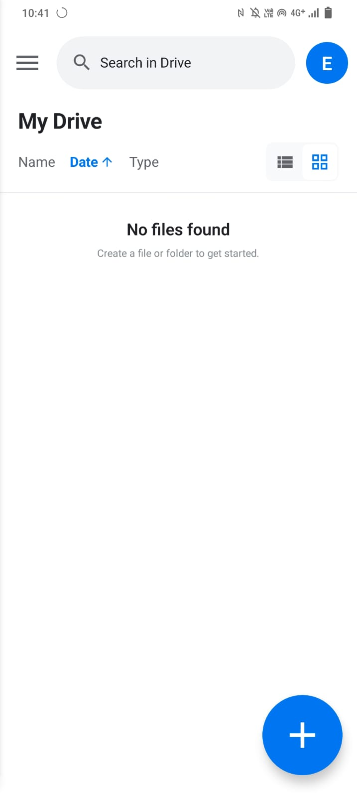
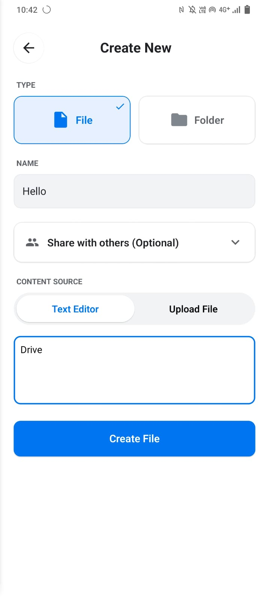
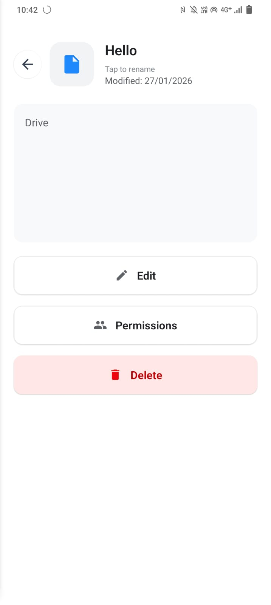
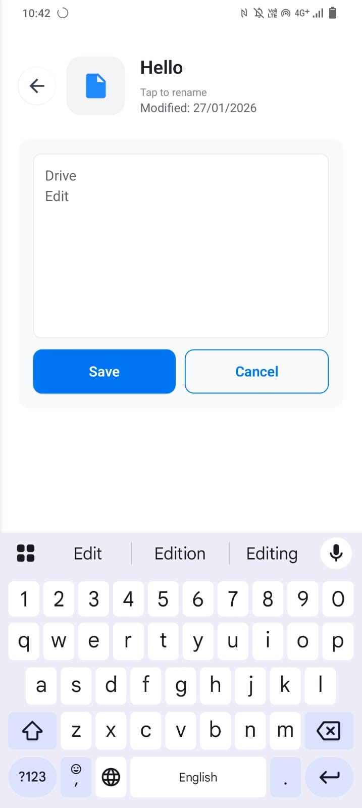
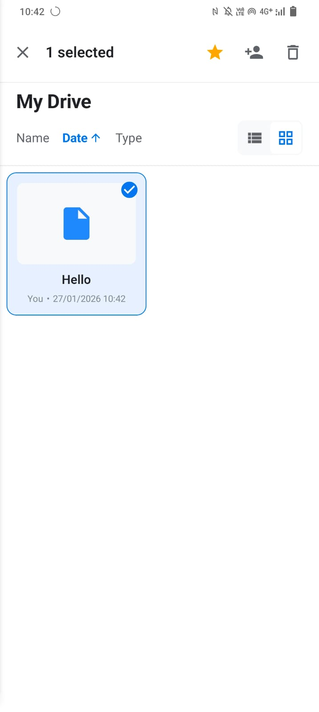
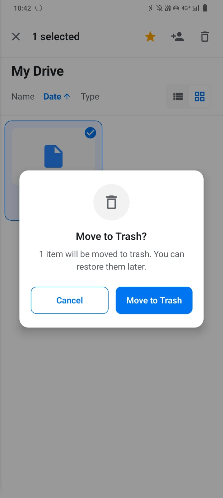
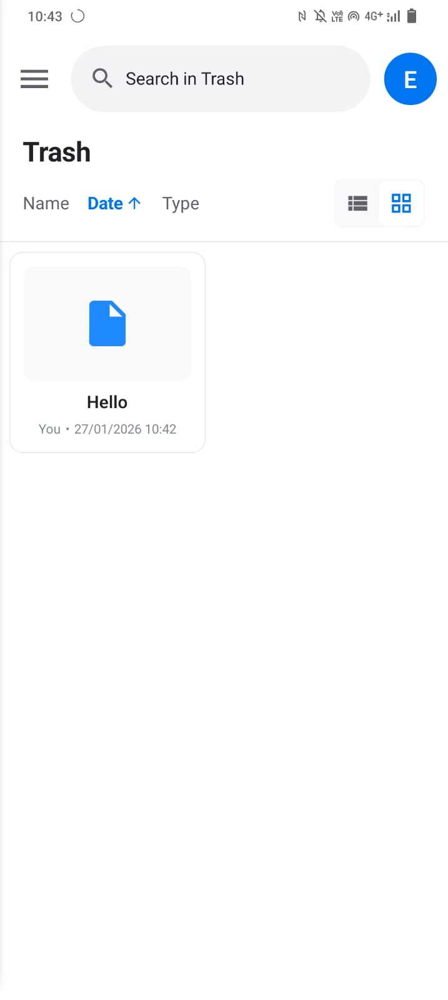

# File and Folder Management (Mobile)

This page demonstrates the core functionalities of the mobile application: creating, editing, and deleting files and folders. The interface is designed to mimic the native Google Drive experience.

---

## 1. Creating New Items

### Step 1: Access the Dashboard

Upon logging in, you will be directed to the **My Drive** dashboard. If the drive is empty, you will see a placeholder message.
To begin creating a new item, tap the **Floating Action Button (+)** located at the bottom-right corner of the screen.

### Step 2: Fill Creation Form

The "Create New" screen allows you to define the properties of your new item:

1.  **Type Selection:** Choose between **File** or **Folder**.
2.  **Name:** Enter a name for your item (e.g., "Hello").
3.  **Content Source:**
    * **Text Editor:** Create a text file directly within the app.
    * **Upload File:** Select a file from your device storage.
4.  **Content:** If "Text Editor" is selected, type your content in the text area.

Tap **"Create File"** to save.

---

## 2. Viewing and Editing

### Step 1: File Selection & Options

Tap on any file in the dashboard to open its details and options menu.
This screen displays the file metadata (Name, Modification Date) and provides action buttons:
* **Edit:** Modify the file name or content.
* **Permissions:** Manage sharing settings.
* **Delete:** Move the file to the trash.

### Step 2: Edit Mode

Clicking the **"Edit"** button opens the editor. You can:
* Rename the file.
* Modify the text content.

Tap **"Save"** to apply changes or **"Cancel"** to discard them.

---

## 3. Deletion Process

### Step 1: Initiate Deletion

You can delete a file in two ways:
1.  From the **File Options** menu (shown above).
2.  By long-pressing a file in the dashboard to enter **Selection Mode**, and then tapping the trash icon in the top bar.

### Step 2: Confirm Deletion

A confirmation modal will appear to prevent accidental deletion.
Tap **"Move to Trash"** to proceed.

### Step 3: Trash View

Deleted files are moved to the **Trash** (soft delete). You can access the Trash from the side drawer menu to view deleted items.

---

## Technical Details

### API Endpoints

**Create Item:**
- **Endpoint:** `POST /api/files`
- **Request Body:** `{ name, type, parentId, content? }`
- **Success Response:** `201 Created` with file object

**Update Item:**
- **Endpoint:** `PUT /api/files/:id`
- **Request Body:** `{ name, content }`
- **Success Response:** `200 OK`

**Delete Item:**
- **Endpoint:** `DELETE /api/files/:id`
- **Logic:** Performs a "soft delete" by updating the `isDeleted` flag in MongoDB to `true`.
- **Success Response:** `200 OK`

### Data Persistence

All file metadata is stored in **MongoDB**. The actual file content (for text files) is stored/compressed via the **C++ TCP Server** or stored directly in the database structure depending on the implementation version (Structure vs. Blob).