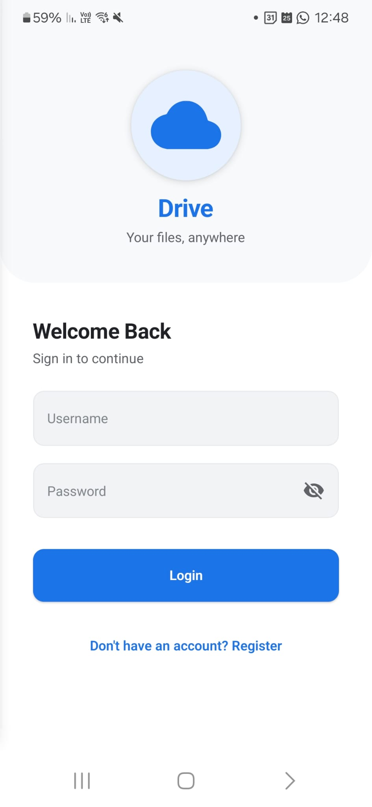
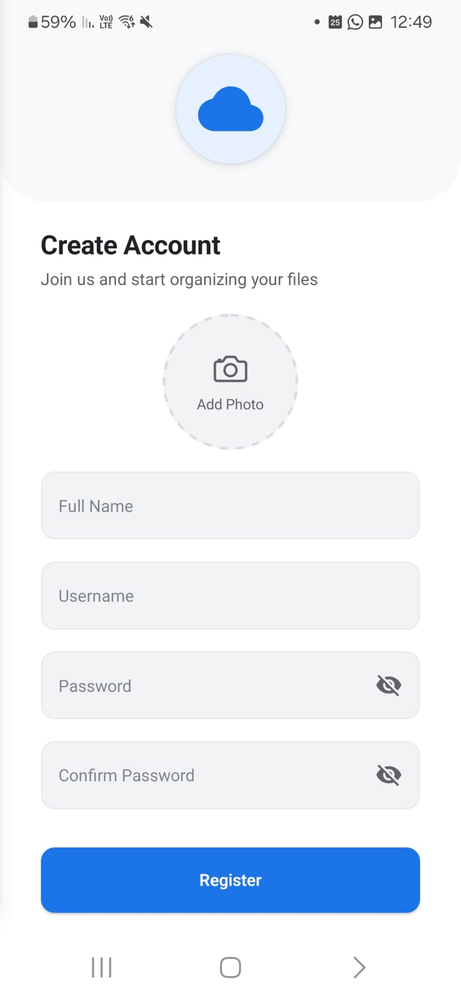
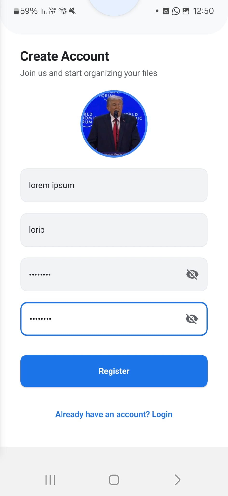
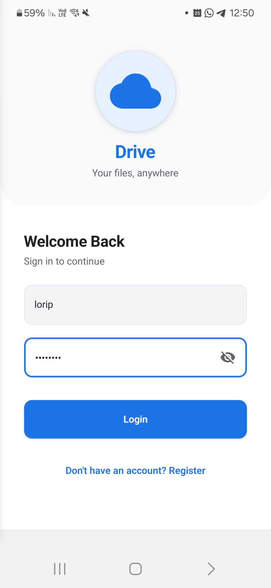
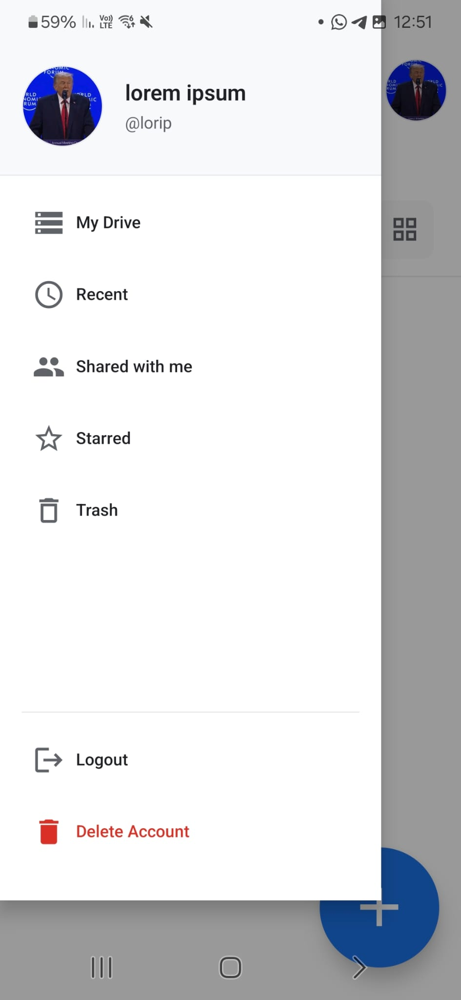

# Login and Registration

This page demonstrates the login, registration, and account deletion processes in the mobile application.

---

## Registration Process

### Step 1: Access Registration Screen

When you first open the mobile app, you will see the **Login Screen**. To register a new account, tap the **"Don't have an account? Register"** link at the bottom of the login screen.

### Step 2: Fill Registration Form

The registration form requires the following fields:
- **Full Name** (required): Your display name
- **Username** (required): Minimum 3 characters, alphanumeric and underscores only
- **Password** (required): Minimum 8 characters, must contain both letters and numbers
- **Confirm Password** (required): Must match the password
- **Profile Image** (optional): Tap the image placeholder to select a photo from your gallery

### Step 3: Select Profile Image (Optional)

1. Tap the circular image placeholder (shows camera icon)
2. Grant permission if prompted
3. Select an image from your gallery

### Step 4: Submit Registration

Fill in all required fields with valid data and tap the **"Register"** button. Upon successful registration, you will be automatically navigated back to the **Login Screen**.

---

## Login Process

### Step 1: Enter Credentials

Enter your **Username** and **Password** in the respective fields. The password is hidden with dots for security.

### Step 2: Submit Login

Tap the **"Login"** button. Upon successful login, you will be automatically navigated to the **Dashboard Screen**. Your JWT token is stored securely in AsyncStorage and your user profile is loaded.

---

## Delete Account

### Step 1: Access Drawer Menu

While logged in, open the side navigation drawer by tapping the hamburger menu icon (☰) in the top-left corner of the screen.

### Step 2: Delete Account

1. Scroll to the bottom of the drawer menu
2. Tap the **"Delete Account"** button (displayed in red)
3. A confirmation modal will appear asking you to confirm the deletion
4. Tap **"Delete Forever"** to confirm

**Warning:** This action is irreversible and will permanently delete your account and all associated data. After deletion, you will be automatically logged out and returned to the login screen.

---

## Technical Details

### API Endpoints

**Registration:**
- **Endpoint:** `POST /api/users`
- **Request Body:** `{ username, password, name, image? }`
- **Success Response:** `201 Created` with user object

**Login:**
- **Endpoint:** `POST /api/tokens`
- **Request Body:** `{ username, password }`
- **Success Response:** `200 OK` with JWT token and user object

**Delete Account:**
- **Endpoint:** `DELETE /api/users/:userId`
- **Success Response:** `200 OK`
- **Note:** Also deletes all unshared files owned by the user

### Validation Rules

- **Username:** Required, 3-50 characters, alphanumeric and underscores only
- **Password:** Required, minimum 8 characters, must contain letters and numbers
- **Name:** Required, maximum 100 characters
- **Image:** Optional, valid image format (JPEG, PNG, GIF, WebP), maximum 10MB

### Security Features

- JWT tokens stored securely in AsyncStorage
- Token expiration: 24 hours (configurable)
- Automatic logout on 401 Unauthorized responses

---
